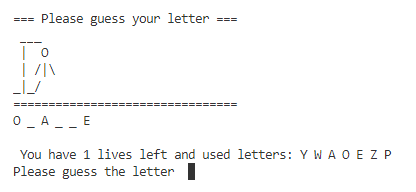

# Hangman Game
>Hangman is classic game with the computer, where computer has a set of words and choose onbe at random and the player tries to guess it in set number of attempts (5 for this game). 

## Table of Contents
* [General Info](#general-information)
* [Technologies Used](#technologies-used)
* [Features](#features)
* [Screenshots](#screenshots)
* [Setup](#setup)
* [Usage](#usage)
* [Project Status](#project-status)
* [Room for Improvement](#room-for-improvement)
* [Acknowledgements](#acknowledgements)
* [Contact](#contact)

## General Information
The project has been undertaken as a part of the training course provided by AiCore.

Major milestones: 
- development of the ask/ check methods as part of the class
- replacement of '_' with the the guessed letters 
- usage of the dictionary for printing ascii picture result

## Technologies Used
    - Python 3.8
## Features
- Good usage of new class development and OOP application.

## Screenshots

## Setup
Project requires the following libraries
    - libraries: os, random, time

## Usage
- The random choice performed by the computer and build-in dictionary for visual
'word=random.choice(word_list).upper()
    word_guessed='_'*len(word)
    hang_dict={
        5:[' ___', ' |', ' |','_|_'],
        4:[' ___', ' |  O', ' |','_|_'],
        3:[' ___', ' |  O', ' | /|','_|_'],
        2:[' ___', ' |  O', ' | /|\\','_|_'],
        1:[' ___', ' |  O', ' | /|\\','_|_/'],
        0:[' ___', ' |  O', ' | /|\\','_|_/ \\']}
    play_game(word_list)'

## Project Status
Project is: _complete_ .

## Room for Improvement
- The obvious step will be to either connect with the dictionary DB or add more to the game storage.
- Add more/better visuals for inhanced performance

## Acknowledgements
- This project was inspired by AiCore program.

## Contact
Created by [@IrinaKW](irina.k.white@gmail.com) - feel free to contact me!

